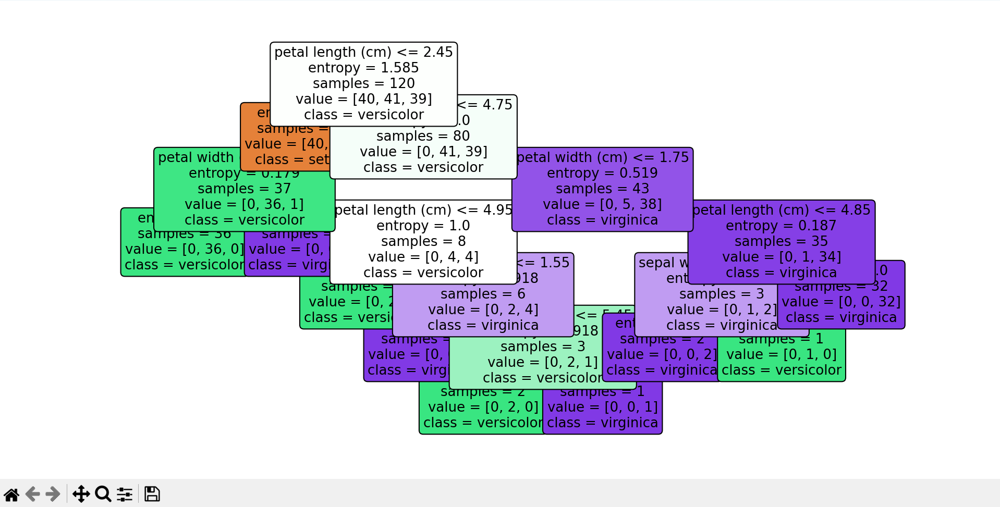
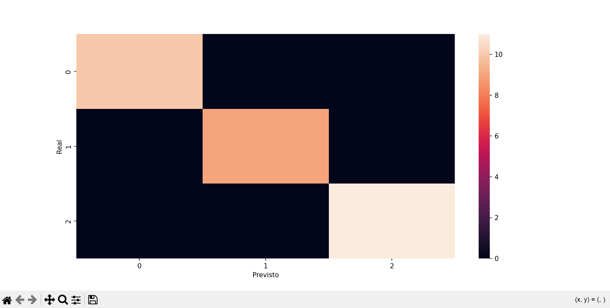

# 🌳 Autoestudo: árvore de decisão na prática

Este repositório contém um autoestudo prático sobre árvores de decisão, utilizando a biblioteca scikit-learn (sklearn) em Python. 

O estudo foi desenvolvido com base no autoestudo "Árvore de Decisão na prática”, aplicando conceitos de Machine Learning supervisionado sobre o dataset Iris.


## 🎯 Objetivo do autoestudo

O objetivo deste projeto é:
- Compreender o funcionamento de Árvores de Decisão;
- Aplicar classificação supervisionada com o dataset Iris;
- Treinar e testar um modelo de Machine Learning;
- Avaliar o desempenho do modelo;
- Visualizar a árvore de decisão e a matriz de confusão.


## 🧠 Conceitos abordados

Neste projeto, são trabalhados os seguintes conceitos:
- Dataset Iris (sklearn.datasets);
- Separação de dados em treino e teste;
- Criação de um modelo de Decision Tree Classifier;
- Avaliação do modelo com acurácia;
- Cálculo manual da acurácia;
- Matriz de confusão;
- Visualização gráfica da árvore de decisão.


## 📦 Bibliotecas utilizadas

```python
import pandas as pd
import matplotlib.pyplot as plt
import seaborn as sns

from sklearn import datasets
from sklearn.model_selection import train_test_split
from sklearn.tree import DecisionTreeClassifier, plot_tree
from sklearn.metrics import accuracy_score, confusion_matrix
```
- Pandas: biblioteca para manipulação de dados;
- Scikit-learn: biblioteca para Machine Learning;
- Matplotlib: biblioteca para visualização de dados;
- Seaborn: biblioteca para visualização de dados.

## 🚀 Como executar o projeto
1. Certifique-se de ter o Python, o Git e o VS Code instalados;

2. Clone este repositório com o seguinte comando no terminal do VS Code:
```bash
git clone https://github.com/luanalima77/Entendendo-arvore-de-decisao-na-pratica.git
```

3. Acesse a pasta do projeto por meio do seguinte comando no terminal do VS Code:
```bash
cd Entendendo-arvore-de-decisao-na-pratica
```

4. Instale, por meio do comando abaixo, as seguintes dependências no terminal do VS Code:
```bash
pip install pandas scikit-learn matplotlib seaborn
```

5. Execute o arquivo principal colocando o seguinte comando no terminal do VS Code:
```python
python main.py
```

6. Após a execução do comando python main.py, serão geradas as seguintes visualizações (figuras 1 e 2):
<div align = "center">
    <p>Figura 1 - Árvore de decisão gerada</p>
    
    <p>Fonte: material retirado do VS Code pela autora (2025).</p>
</div>
<br>

<div align = "center">
    <p>Figura 2 - Matriz de confusão gerada</p>
    
    <p>Fonte: material retirado do VS Code pela autora (2025).</p>
</div>
<br>

### ✍️ Projeto com fins educacionais